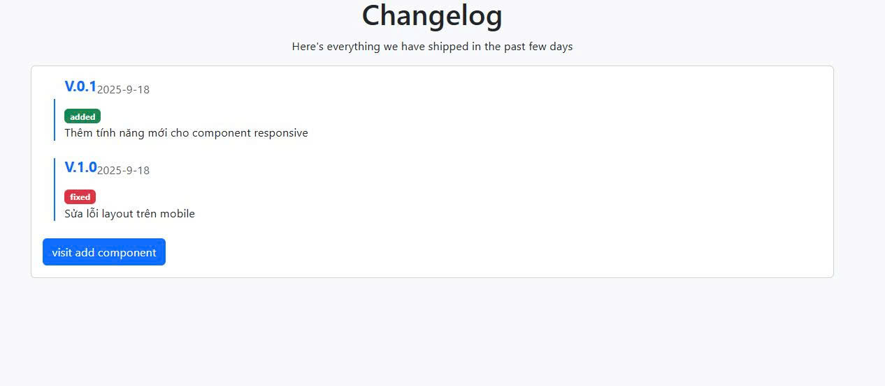
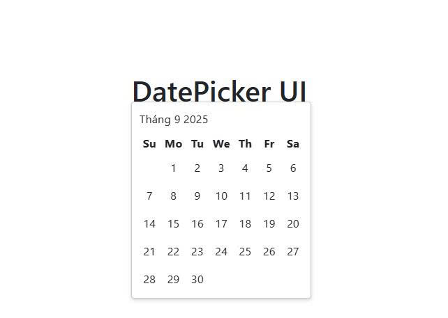

# Roadmap.sh Projects 🚀
Mini projects from roadmap.sh frontend roadmap for learning and portfolio(Các dự án nhỏ từ roadmap.sh frontend roadmap để học tập và xây dựng portfolio)

Repository này tập hợp các dự án nhỏ mà mình thực hiện theo lộ trình [frontend roadmap](https://roadmap.sh/frontend/projects).  
Mục tiêu chính:
- Luyện tập kiến thức HTML, CSS, JavaScript và các công nghệ frontend.
- Xây dựng các mini project để làm quen với cách tổ chức code thực tế.
- Tạo portfolio cá nhân để theo dõi tiến trình học tập.

---

## 📂 Dự án đã thực hiện
- [changelog component](https://github.com/TanHung189/Roadmap.sh-Project/tree/main/changelog-component-project) -> [link roadmap](https://roadmap.sh/projects/changelog-component)
- [datepicker ui](https://github.com/TanHung189/Roadmap.sh-Project/tree/main/datepicker-ui) -> [link roadmap](https://roadmap.sh/projects/datepicker-ui)
- [tabs](https://github.com/TanHung189/mini-frontend-project/tree/main/tabs-project) -> [link roadmap](https://roadmap.sh/projects/simple-tabs)
- [StopWatch](https://github.com/TanHung189/mini-frontend-project/tree/main/Stopwatch)


<p align="left">
  <a href='https://github.com/TanHung189/mini-frontend-project/tree/main/Stopwatch'>
    
  </a>
  <a href='https://github.com/TanHung189/mini-frontend-project/tree/main/changelog-component-project'>
    
  </a>
</p>

<p align="left">
  <a href='https://github.com/TanHung189/mini-frontend-project/tree/main/datepicker-ui'>
    
  </a>
  <a href='https://github.com/TanHung189/mini-frontend-project/tree/main/tabs-project'>
    
  </a>
</p>


_(Sẽ cập nhật thêm khi hoàn thành các project khác)_

---

## 🚀 Công nghệ sử dụng
- **Frontend**: HTML5, CSS3, JavaScript (ES6+)
- **CSS Frameworks**: Bootstrap / TailwindCSS (tùy project)
- **API**: Fetch API / REST API
- **Tools**: Git, GitHub, VSCode

---

## ▶️ Cách sử dụng
Clone repo về máy và mở project bạn muốn:
```bash
git clone https://github.com/TanHung189/mini-frontend-project.git
cd mini-frontend-project
